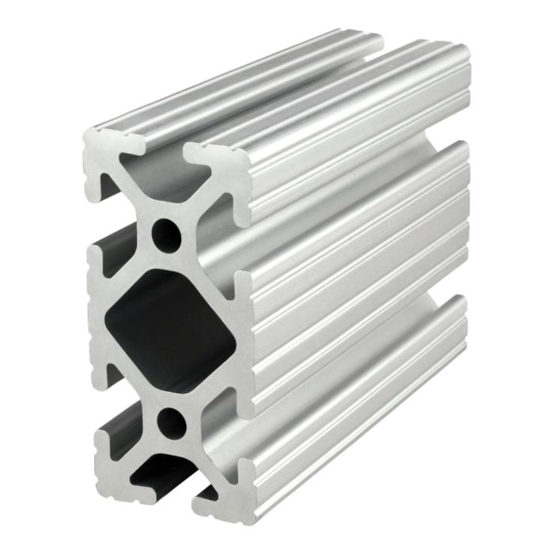
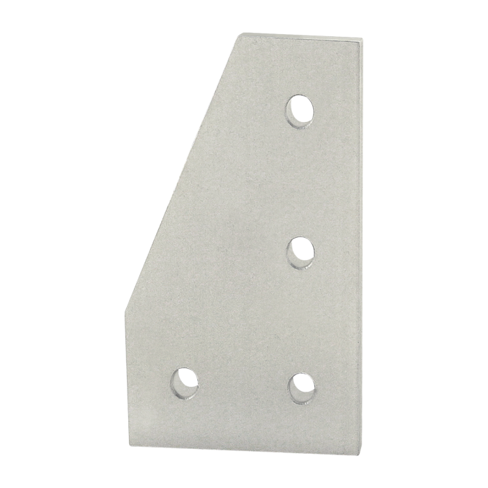

title: Robot Planning

## Mechanical Planning

### Frame Planning
I started off my mechanical planning for the RoboPack by thinking about the frame of the robot. From my previous robotics experience, I have learned that modularity and the ability to re-use and adjust is essential. To ensure optimal flexability, I chose to use 80/20 tubing, specifically the 1530 & 1515 series tubing shown below for robust structure, flexible attachment points, and premade strong brackets that can be re-used and moved.

| 1530 Tubing                           | 15Series Bracket                      |
| ------------------------------------- | ------------------------------------- |
| |  |

### Style Planning
After getting all the functionality down, I plan to use a nice wood to give a natural style to the robot. Another idea I have is to get plastic parts that can cover the machine as well, but that might be more complicated and expensive.

## Hardware Planning

### Motors & Motor Controller
I am planning to use CIM motors which I've learned from my robotics teams, the reason for using a CIM motor is due to low costs sitting at around 17$, and the output it produces being 5,330 RPM, with 21.33 in/lbs of torque which is pretty powerfull and should definatly ensure a job well done.

## Software Planning